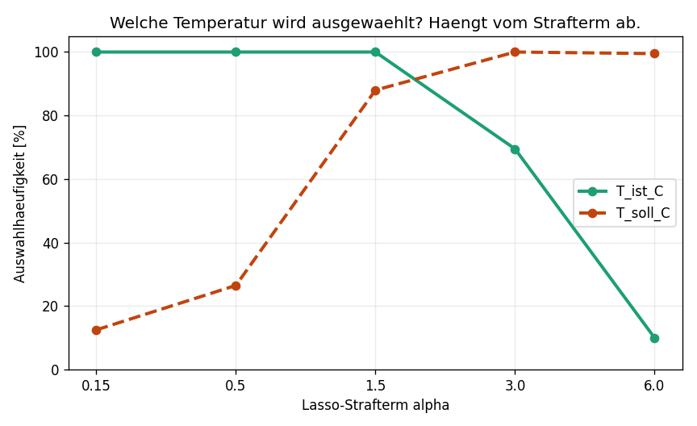
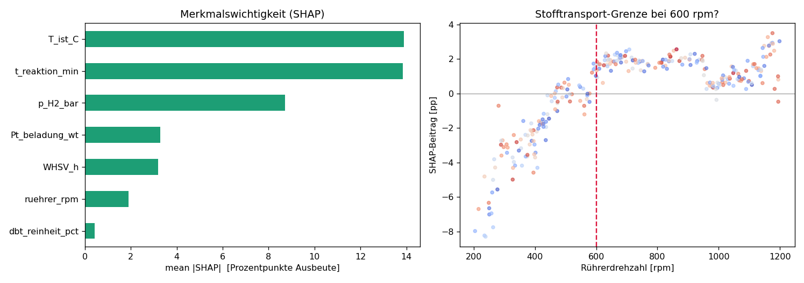

# Automated Feature Discovery for LOHC Dehydrogenation

**Which variables actually govern the yield of a catalytic dehydrogenation — and can a
machine-learning pipeline find them without being told?**

This project builds an automated feature-discovery and model-selection workflow for a
batch LOHC dehydrogenation campaign (H₁₈-DBT → H₀-DBT over Pt/Al₂O₃), then asks a harder
question than "how accurate is the model": *did it select the right variables, and would
the model still work in a different reactor?*

---

## Quick Look

| Question | Result |
|---|---|
| Best model structure | Gaussian process, **R² = 0.965**, RMSE 5.26 pp (10-fold CV) |
| Does encoding chemical knowledge cost accuracy? | **No** — the physics-informed feature set beat the all-features set for **all four** model families |
| Did feature selection find the causal temperature? | **Only sometimes.** Lasso picked the causal variable at weak penalties and the non-causal proxy at strong ones — the answer flips with a hyperparameter |
| Did any selection method find the mass-transfer threshold? | **No.** All five scored it as noise (Pearson r = +0.04) |
| Did SHAP find it? | **Yes.** +1.98 pp per 100 rpm below 600 rpm, −0.10 pp above — a 20× slope change at the correct threshold |
| Does the variable choice matter for transfer? | **Yes.** Under simulated scale-up, the proxy model's error tripled (5.1 → 15.1 pp); the physics-informed model moved 10% (4.4 → 4.9 pp) |

**The headline finding:** on the original reactor, the proxy-based and physics-based models
differ by 0.7 pp RMSE — cross-validation calls them equivalent. The difference only appears
when the reactor changes. Standard validation cannot see the fragility it is validating.

---

## In plain language

Imagine 280 reactor runs. For each one you logged the temperature you asked the controller
for, the temperature actually measured inside, the pressure, the stirring speed, how much
platinum, how long it ran — plus a few things that cannot possibly matter, like the batch
number. You measured the yield each time. Now: which of those knobs actually control the
outcome?

It sounds like a question statistics should answer. Mostly, it isn't.

Two of the logged variables are temperatures that track each other almost perfectly
(r = 0.99). Only one of them — the *measured* internal temperature — is the variable that
appears in the Arrhenius equation and physically drives the reaction. The other is the
controller setpoint: an instruction, not a cause. Its influence reaches the yield only
*through* the measured temperature.

Every purely statistical method in this repository either picks the wrong one, or picks the
right one for a reason that evaporates when you change a hyperparameter. What settles the
question is knowing where the temperature sits in the rate law.

And that choice is not cosmetic. Build the model on the setpoint and it quietly learns your
controller's habits alongside the chemistry. Move to a bigger reactor where heat transfer is
worse and the controller behaves differently, and the model breaks — while the one built on
the measured temperature keeps working.

---

## Repository contents

| File | Purpose |
|---|---|
| `generate_data.py` | Synthetic campaign, Langmuir-Hinshelwood kinetics with H₂ product inhibition |
| `feature_selection.py` | Pearson, mutual information, Lasso, random-forest importance, stability selection |
| `model_comparison.py` | Ridge / random forest / gradient boosting / Gaussian process, two feature sets, common CV |
| `shap_analysis.py` | SHAP attribution; tests recovery of the mass-transfer threshold |
| `transfer_test.py` | Scale-up scenarios with a shifted setpoint-to-measured relationship |
| `run_all.py` | Reproduces every result and figure |

```bash
pip install -r requirements.txt
python run_all.py
```

---

## Why the data is synthetic

Real campaign data from an industrial partner cannot be published. More importantly, a
synthetic generator provides something real data never does: **ground truth**. Because the
rate law is written down, every selection method can be *graded* rather than merely compared.

The generator is designed so that the answer is not trivially recoverable. It contains:

- **five genuine drivers** — measured temperature (Arrhenius), reaction time, H₂ backpressure
  (LH inhibition), WHSV, Pt loading (sub-linear in active sites)
- **a mediated proxy** — the controller setpoint, r = 0.99 with the measured temperature,
  causally upstream but with its entire effect mediated through it
- **a confounder** — Pt loading raises yield directly, but higher activity deepens the
  endothermic dip and *lowers* the measured temperature, partly masking its own effect
- **a conditional driver** — stirrer speed matters below 600 rpm (mass-transfer limited) and
  is physically irrelevant above it
- **three pure-noise columns** — batch number, ambient temperature, storage days
- **heteroscedastic measurement noise**, larger at low conversion, as with GC-FID

---

## Results in detail

### 1. Feature selection: graded against ground truth

| Method | Verdict |
|---|---|
| Pearson correlation | Fooled — ranked the proxy (r = 0.587) above the causal variable (r = 0.580) |
| Mutual information | Worst — scored pure noise (`charge_nr`, 0.283) above a real driver (`WHSV`, 0.000) |
| Random-forest importance | Fooled — `T_soll` 0.495 vs `T_ist` 0.219 |
| Lasso (CV-tuned α) | Correct on the temperature pair; false-negative on the weak purity driver |
| Stability selection | Did not pick a winner, but revealed *why* no winner exists |

Two results worth internalising:

**Collinearity alone does not break Lasso.** The textbook claim — that Lasso chooses
arbitrarily among correlated features — assumes the features are *exchangeable*. Here they
are not: the setpoint is effectively the measured temperature plus noise, so Lasso prefers
the cleaner variable, which happens to be the causal one. Collinearity *plus exchangeability*
is what breaks it.

**Cross-validation tunes for the wrong objective.** At the CV-optimal α, pure-noise features
survived in ~97% of bootstrap resamples. The penalty that predicts best is far too permissive
to *select* well. Using one α for both jobs is a quiet and common error.



The two curves cross. Which temperature the pipeline "discovers" is a function of the
regularisation strength — a quantity with no chemical meaning whatsoever.

### 2. Model comparison

10-fold CV, identical folds, RMSE in percentage points of yield:

| Model | R² (all features) | R² (physics-informed) |
|---|---|---|
| Gaussian process | 0.9534 | **0.9650** |
| Gradient boosting | 0.9243 | 0.9266 |
| Ridge | 0.8974 | 0.8982 |
| Random forest | 0.8591 | 0.8661 |

Encoding domain knowledge is usually described as trading accuracy for interpretability.
Here it was not a trade: removing the proxy and the noise columns improved *every* model.

### 3. SHAP: recovering physics the selection methods missed



SHAP is computed on gradient boosting rather than the Gaussian process, since tree models
admit an exact, fast algorithm.

Feature-selection methods return one number per variable for the whole dataset. For stirrer
speed, that number averages a strong effect below 600 rpm with a zero effect above it, and
reports approximately nothing. SHAP attributes per *run*, so the two regimes stay separate:

```
slope  < 600 rpm:  +1.975 pp per 100 rpm
slope >= 600 rpm:  -0.099 pp per 100 rpm
```

The signs are also a physics check. Higher H₂ backpressure contributes *negatively* —
consistent with Langmuir-Hinshelwood product inhibition. A model showing the opposite would
be wrong regardless of its R².

*Caveat, stated rather than hidden:* the plateau above 600 rpm is not perfectly flat. The dip
near 1000 rpm and the uptick near 1150 rpm are the model fitting noise, not chemistry.

**SHAP explains the model, not reality.** Given the all-features set, it would faithfully
report that yield depends on the controller setpoint. It cannot know that variable is not a
cause. Physics must choose the features *first*; SHAP then verifies the model respects them.
Reversed, the result is a beautifully explained wrong model.

### 4. Transfer test

Models trained on the original campaign, evaluated on a simulated scale-up reactor with
poorer heat transfer (endothermic dip doubled, plus an 8 K thermocouple offset). **The
kinetics are unchanged** — only the setpoint-to-measured relationship shifts.

Gaussian process, RMSE in percentage points:

| Feature set | Same reactor | Dip ×2 | Dip ×2 + 8 K |
|---|---|---|---|
| Proxy (`T_soll`) | 5.14 | 8.09 | **15.08** |
| Kitchen sink (both + noise) | 5.90 | 6.18 | 7.13 |
| Physics (`T_ist`) | **4.44** | 4.59 | **4.90** |

The kitchen-sink model is instructive: it *had* the causal variable available, but spread its
trust across both temperatures and inherited part of the proxy's fragility. Including
everything is not a safe default.

---

## Limitations

- The ground truth is a single rate law. Real systems have deactivation, mass-transfer
  regimes that shift with conversion, and impurity effects not modelled here.
- Only one collinear pair is studied. Industrial historians routinely contain dozens.
- The transfer scenario shifts one relationship; real scale-up changes several at once.
- 280 runs is a realistic campaign size but small for machine learning; mutual-information
  estimates in particular are unreliable at this sample size, as the results show.

## Background

Built by Shubhom Moulick (M.Sc. Clean Energy Processes, FAU Erlangen-Nürnberg). The kinetic
model follows the Langmuir-Hinshelwood formulation used in the companion repository
`lohc-dehydrogenation-sim`. Domain assumptions draw on batch-autoclave dehydrogenation work
at Hydrogenious LOHC Technologies and catalyst research at HI ERN Erlangen.
